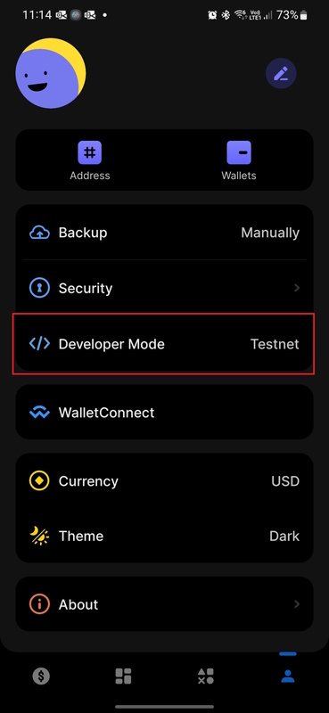
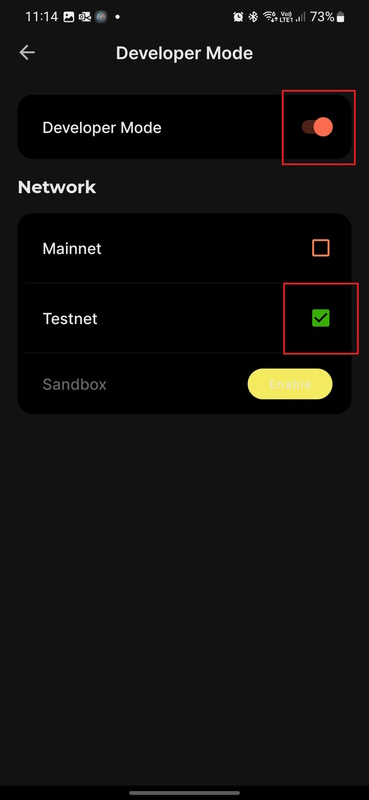

# Flow Unity SDK - FlowWords Sample

This sample is a working pre-deployed version of our FlowWords tutorial sample, running on FLOW Testnet.\
To use this sample you will need a WalletConnect compatible Testnet wallet. e.g. Lilico.

If you do not already have a compatible wallet, you can sign up for one here: [https://lilico.app](https://lilico.app)\
You will need to install the mobile phone app. (iOS or Android)

Once installed, you will need to enable dev mode in the Lilico app, do so as follows;
1. Go to the settings menu, by clicking the profile icon on the bottom right corner of the screen.
2. Select Developer Mode to enter the Developer mode submenu

    

3. Enable Developer Mode with the toggle at the top of the screen, and then set the network to TestNet.

    

4. Back out to the wallet dashboard by clicking the back button at the top left of the screen, then clicking the Dashboard button (small $) in the bottom left corner of the screen.
5. At this point your wallet should say TESTNET at the top of the screen. If your FLOW balance is zero, you can fund your Testnet account via the FLOW Testnet Faucet here: [https://testnet-faucet.onflow.org/fund-account](https://testnet-faucet.onflow.org/fund-account)
    1. Enter your Testnet account address, as shown in the Lilico app
    2. Complete the captcha, and click 'Fund Your Account'
    3. Refresh your Lilico app on your device to see your new FLOW balance! (swipe down on the dashboard screen)

We assume you have already added the SDK package to your Unity project, and Imported the FlowWords Sample using the Unity Package Manager.
If you have not already done so, do this now. You can find instructions on how to do so [here.](https://developers.flow.com/tools/unity-sdk/index#adding-the-flow-sdk)

1. Open Game.scene from the FlowWords sample folder. (Samples\Flow SDK\\\<version>\Flow Words\Scenes)
2. Press Play in Unity to run the game sample.
3. Whenever the game presents you with a QR code, scan the code with your mobile Wallet App, and approve the transactions on your mobile device!