# Tutorial - How to Build FlowWords

## Outline

The FlowWords tutorial example project is the complete FlowWords game, with the FlowSDK and any SDK related code removed.

In this tutorial, you will learn how to;

1.  Configure the FlowSDK and local emulator for use with Unity
2.  Deploy contracts, create Accounts and run Transactions on the Flow emulator from within Unity.
3.  Incorporate Flow Accounts, Transactions and Scripts into Unity projects using Code

## Requirements

FlowWords Tutorial has been tested on Unity version 2021.3.6f1

This tutorial assumes you have created a blank project, and installed the FlowSDK package from the Unity Asset Store, and FlowWords Tutorial Sample.

## Step 1 – Configure the FlowSDK and local emulator

1.  Open the scene at Assets\\Samples\\Flow SDK\\\<version\>\\Flow Words Tutorial Assets\\Scenes\\Game.unity

    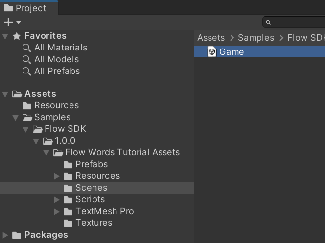

2.  Open the Flow Control Manager window, at Window-\>Flow-\>Flow Control.  
    This will create a Flow Control GameObject in the Game scene, and a FlowControlData asset in the Resources folder if they do not already exist.

    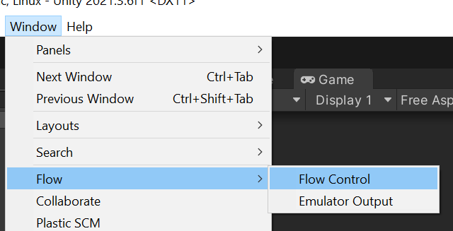

3.  Go to the Emulator Settings tab. If the manager states the Flow Executable cannot be found, use the Install button provided and follow the instructions to install the Flow CLI.  
    Note: If Unity still does not detect the emulator after installing the Flow CLI, you may need to restart your computer for the install to take effect.
4.  Set a directory for our Emulator data to reside in. This is where the emulator stores the state of the emulated Flow blockchain.  
    For the purposes of this tutorial, we will create a new folder called FlowEmulator inside our project folder.

    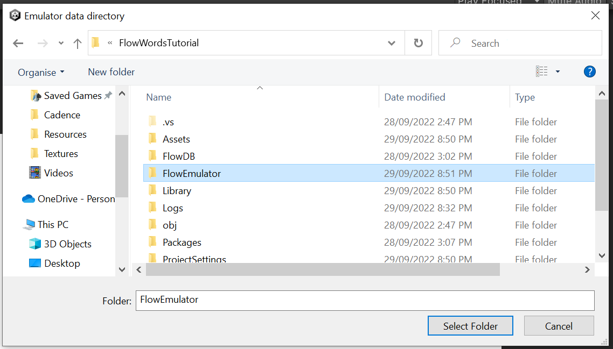

5.  Click Start Emulator to start the emulator and create the emulator_service_account, and ensure “Run emulator in play mode” is checked.

    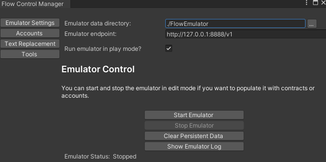

    NOTE: If this is the first time you have run the emulator on Windows, you may be presented with a dialog to allow access through your firewall. This is safe to allow.  
	
6.  Go to the Accounts tab and verify that the service account has been created.  
    This is the account we will use to create more accounts, and deploy our game contract on to the emulator.

    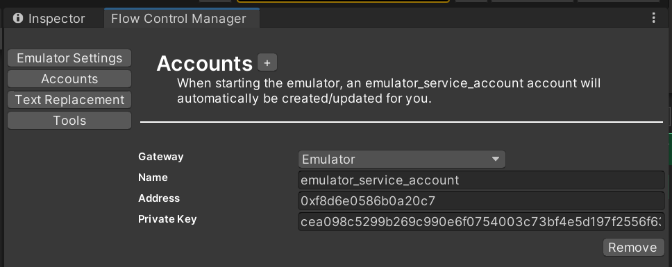

7.  Back on the Emulator Settings tab, you can click Show Emulator Log, to view the output.

    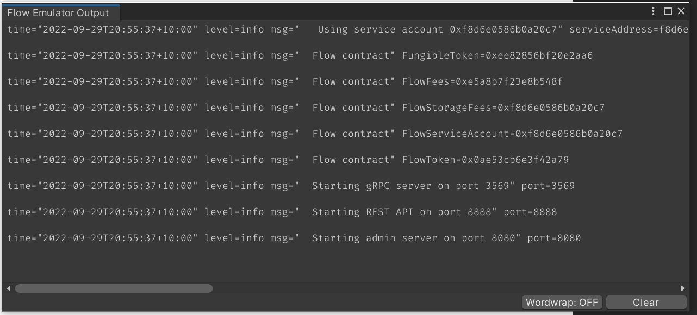

## Step 2 – Deploy Contracts, create Accounts and run Transactions

We have provided you with the FlowWords game contract, but before we can interact with the contract, we have to deploy it to the blockchain.

We also have to set up some text replacements as, once deployed, our scripts will require hardcoded references to the contract name and deployed address.

### Set up Text Replacements

Text replacements allow us to set and update references across all of our local Cadence scripts, without having to update each file individually.

1.  Open the Flow Control Manager window, and navigate to the Text Replacements tab.
2.  Set up the text replacements as follows. You can add text replacements by clicking the ‘+’ button at the top of the panel.

    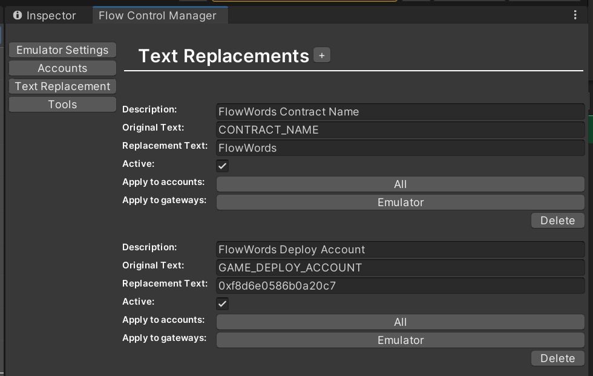

    The anatomy of a text replacement is as follows;  
    **Description**: A friendly description, has no bearing on functionality.  
    **Original Text**: The original text, in your script files, which you want to replace.  
    **Replacement Text**: The text that you wish to replace the original text with. This is what gets submitted to the chain.  
    **Active**: This checkbox enables or disables the text replacement.  
    **Apply to Accounts**: Select which, if any, accounts this text replacement should apply to.  
    **Apply to Gateways**: Select which, if any, gateways (such as Emulator, or TestNet) this replacement should apply to.

### Create User Accounts

While it would be perfectly possible to play our game with the emulator service account, we will often want to test our contracts with multiple different user accounts.

To create a new user account;

1.  Open the Flow Control Manager window, and navigate to the Tools tab.
2.  In the Create New Account section;

    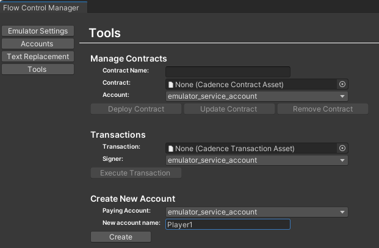

    1.  Select the paying account. This will usually be the emulator_service_account
    2.  Enter a friendly name for the new account. This name is just for your own reference and does not get written to the chain.
    3.  Click Create
3.  If successful, the new account will appear under the Flow Control Manager Accounts tab.

    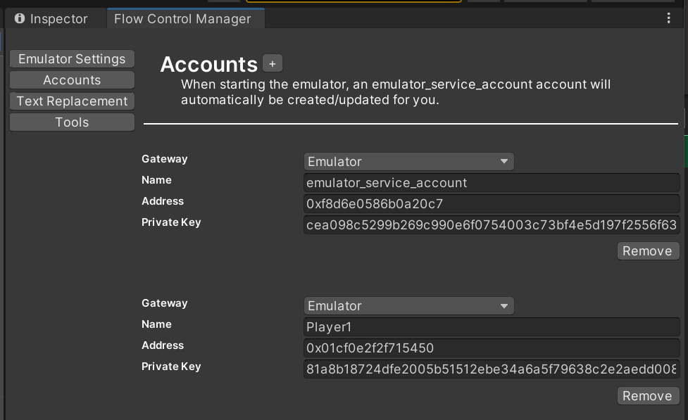

### Deploy the Contract

Before anyone can interact with a contract, it must be deployed to the blockchain.

We are going to deploy our game contract to the emulator, for local testing. But for deploying to Testnet, or Mainnet follow the same process.

1.  Go to the Emulator Settings tab, in the Flow Control Manager, and Start the Emulator if it is not already running.
2.  Go to the Tools tab. In the Manage Contracts section, enter the contract name of ‘FlowWords’ – this should match our CONTRACT_NAME text replacement precisely.
3.  Populate the Contract field with game-contract.cdc, which can be found in Resources/contracts
      
    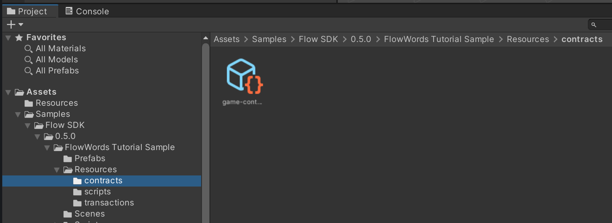
	
4.  Finally, ensure that the Account field contains emulator_service_account, and click the Deploy Contract button.

    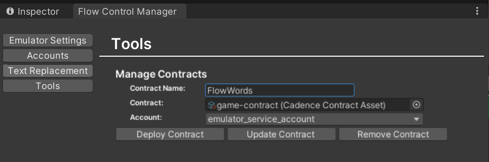

5.  To check if the contract has deployed successfully, open the Flow Emulator Output window. Successful deployment will look as follows;

    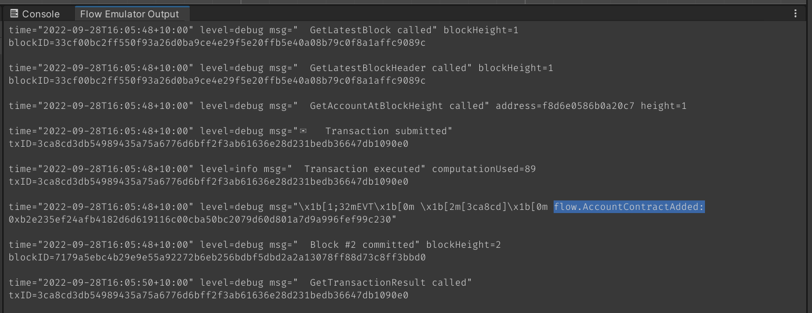

### Submit Transactions

For administration purposes, it is sometimes useful to be able to directly submit transactions to the chain.

We can use a transaction to check out text replacements are set up correctly, and our game contract has successfully deployed.

1.  In Flow Control Manager, navigate to tools.
2.  In the Transactions section;

    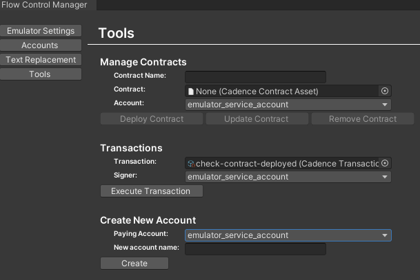

    1.  Populate the Transaction field with check-contract-deployed.cdc, located in Resources/transactions
	          
        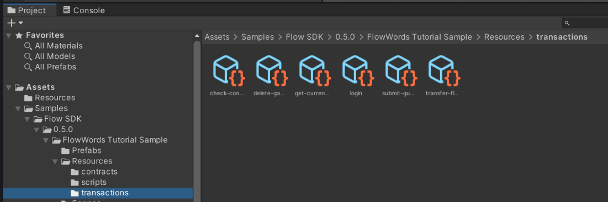
		
    2.  Set the Signer field to the new Account we just created earlier. ‘Player1’
    3.  Click Execute Transaction
3.  If you have successfully configured the SDK and deployed the game contract, you will see the following message;

    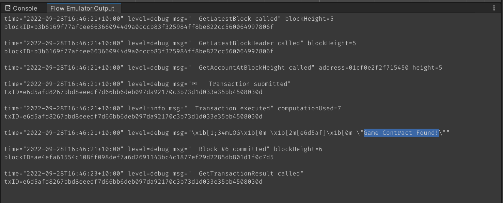

## Step 3 – Incorporate Flow Accounts, Transactions and Scripts into Code

We have our SDK and emulator configured, and our game contract deployed.  
Now we are going to create the code which will allow our game to send and receive data from the blockchain.

Our FlowWords tutorial project contains a script called FlowInterface.cs, which can be found in the Scripts folder. This script contains all of our blockchain interfacing functions, which are called from GameManager.cs and UIManager.cs.

Our game FlowInterface has 5 main functions:

-   Login
-   Logout
-   GetGameDataFromChain
-   SubmitGuess
-   LoadHighScoresFromChain

Our functions are going to need to access a number of cadence scripts and transactions.  
These have been provided for you, and can be found in the Resources\\scripts folder and Resources\\transactions folder.

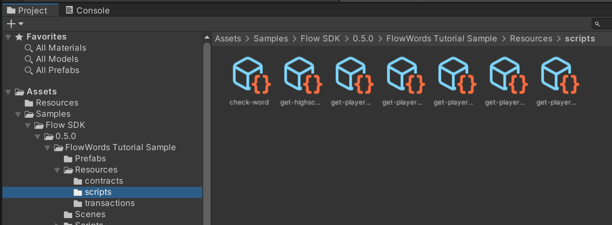

FlowInterface.cs has a number of Serialized TextAsset fields, which can be populated via the Unity inspector. Select the GameFlowInterface gameobject in the Game.unity scene, and populate the fields as follows, using the scripts and transactions in the aforementioned folders; (you may find these have already been populated for you)

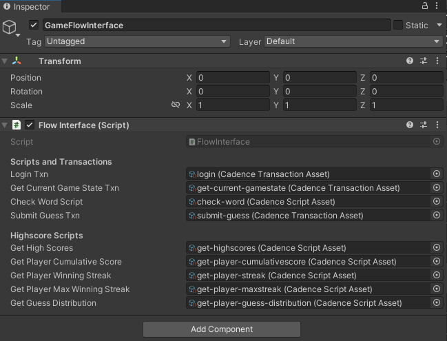

### Login
Open FlowInterface.cs and find the Login function stub.

The Login function’s role is to take the credentials entered by the user, create a FlowControl.Account object with which we can submit transactions to the chain, and run the login.cdc transaction.

At the top of the file, add the following using statements to grant us easy access to the Flow SDK structures.

```csharp
using DapperLabs.Flow.Sdk.Cadence;
using DapperLabs.Flow.Sdk.DataObjects;
using DapperLabs.Flow.Sdk.DevWallet;
using Convert = DapperLabs.Flow.Sdk.Cadence.Convert;
```

Your file should now look like this:

```csharp
using System;
using System.Collections;
using System.Collections.Generic;
using System.Linq;
using System.Numerics;
using System.Threading.Tasks;
using UnityEngine;
using DapperLabs.Flow.Sdk;
using DapperLabs.Flow.Sdk.Unity;
using DapperLabs.Flow.Sdk.Cadence;
using DapperLabs.Flow.Sdk.DataObjects;
using DapperLabs.Flow.Sdk.DevWallet;
using Convert = DapperLabs.Flow.Sdk.Cadence.Convert;
```

Uncomment the following at line 56:
```csharp
//private FlowControl.Account FLOW_ACCOUNT = null;
```

We now have to register a wallet provider with the Flow SDK. We are going to use DevWallet, which comes with the Flow SDK, and is only intended for development purposes on emulator and testnet. Add the following to the `Start` function:

```cs
// Set up SDK to access Emulator
FlowConfig flowConfig = new FlowConfig()
{
    NetworkUrl = "http://127.0.0.1:8888/v1",  // emulator
    Protocol = FlowConfig.NetworkProtocol.HTTP
};
FlowSDK.Init(flowConfig);

// Register DevWallet wallet provider with SDK
FlowSDK.RegisterWalletProvider(new DevWalletProvider());
```
Your Start function should now look like this:

```csharp
private void Start()
{
    if (Instance != this)
    {
        Destroy(this);
    }

    // Set up SDK to access Emulator
    FlowConfig flowConfig = new FlowConfig()
    {
        NetworkUrl = "http://127.0.0.1:8888/v1",  // emulator
        Protocol = FlowConfig.NetworkProtocol.HTTP
    };
    FlowSDK.Init(flowConfig);

    // Register DevWallet wallet provider with SDK
    FlowSDK.RegisterWalletProvider(new DevWalletProvider());
}
```

> **WARNING:** Do not use DevWallet in production builds. It is only intended for development purposes and does NOT securely store keys.\
Having the Address and Private Keys to a blockchain account gives your application full access to all of that account’s funds and storage. They should be treated with extreme care.

Next, we will fill out the body of the Login function.

```csharp
/// <summary>
/// Attempts to log in by executing a transaction using the provided credentials
/// </summary>
/// <param name="username">An arbitrary username the player would like to be known by on the leaderboards</param>
/// <param name="onSuccessCallback">Function that should be called when login is successful</param>
/// <param name="onFailureCallback">Function that should be called when login fails</param>
public void Login(string username, System.Action<string, string> onSuccessCallback, System.Action onFailureCallback)
{
    // Authenticate an account with DevWallet

}
```

First, we have to invoke the wallet provider to authenticate the user and get their flow address. Add the following code to the Login function;

```cs
// Authenticate an account with DevWallet
FlowSDK.GetWalletProvider().Authenticate(
    "", // blank string will show list of accounts from Accounts tab of Flow Control Window
    (string address) => onSuccessCallback(address, username), 
    onFailureCallback);
```

The Authenticate function takes parameters as follows;

-	The first parameter is a username which corresponds to the name of an account in the Accounts tab. If you leave this string blank (as above), a dialog will be shown to the user to select an account from the Accounts tab. 
-	The second parameter is a success callback for `Authenticate()`. We pass in a lambda function which starts a coroutine to run our async function `OnAuthSuccess`. This takes the flow address that we got from `Authenticate()`, as well as a few other parameters. 
-	The third parameter is a callback for if `Authenticate()` fails. We pass through the fail callback that was passed to Login. 

Your completed Login function should look as follows; 

```csharp
/// <summary>
/// Attempts to log in by executing a transaction using the provided credentials
/// </summary>
/// <param name="username">An arbitrary username the player would like to be known by on the leaderboards</param>
/// <param name="onSuccessCallback">Function that should be called when login is successful</param>
/// <param name="onFailureCallback">Function that should be called when login fails</param>
public void Login(string username, System.Action<string, string> onSuccessCallback, System.Action onFailureCallback)
{
    // Authenticate an account with DevWallet
    if (FlowSDK.GetWalletProvider().IsAuthenticated() == false)
    {
        FlowSDK.GetWalletProvider().Authenticate(
            "", // blank string will show list of accounts from Accounts tab of Flow Control Window
            (string address) => onSuccessCallback(address, username),
            onFailureCallback);
    }
}

```
Now we need to implement the `GetGameDataFromChain` function for when we successfully authenticate our user and get their flow address.\
At this point we have successfully authenticated our user, and all subsequent Scripts and Transactions will be submitted via the authenticated account.


### GetGameDataFromChain

This function executes the get-current-gamestate.cdc transaction on the chain, and then processes the emitted events to get the CurrentGameState for the logged in account, and current GameStartTime for the game of the day, which we use to show time remaining.

```csharp
/// <summary>
/// Attempts to get the current game state for the user from chain.
/// </summary>
/// <param name="username">An arbitrary username the player would like to be known by on the leaderboards</param>
/// <param name="onSuccessCallback">Callback on success</param>
/// <param name="onFailureCallback">Callback on failure</param>
public IEnumerator GetGameDataFromChain(string username, System.Action<Decimal, List<GuessResult>, Dictionary<string, string>> onSuccessCallback, System.Action onFailureCallback)
{
    // get FLOW_ACCOUNT object for text replacements

    // execute getCurrentGameState transaction on chain

    // check for error. if so, break.

    // transaction success, get data from emitted events

    // process currentGameState event

    // process gameStartTime event

    // call GameManager to set game state

    yield return null;
}
```

As you will recall, we previously configured a number of text replacements.\
These are useful, and allow us to easily change some hardcoded data from a contract or transaction, such as the deploy address of the contract, from one central location without having to edit every cadence script in our project.\
Our transactions and scripts will need to access the text replacement function, which lives in the FlowControl.Account class, so we need to first create a FlowControl.Account object as follows;

```cs
// get FLOW_ACCOUNT object for text replacements
FLOW_ACCOUNT = new FlowControl.Account
{
    GatewayName = "Emulator",   // the network to match
    AccountConfig = new Dictionary<string, string> { { "Address", FlowSDK.GetWalletProvider().GetAuthenticatedAccount().Address } } // the account address to match
};
```

We are about to pull down the user's saved game data. To make processing event data easier, we have declared three classes to hold the results of events emitted by transactions:

```csharp
public class StatePayload
{
    public List<GuessResult> currentState;
}

public class TimePayload
{
    public Decimal startTime;
}

public class GuessResultPayload
{
    public string result;
}
```

Let's compare these to the payloads for each event in the contract:

```cadence
pub event CurrentState(currentState: [UserGuess])
pub event LastGameStart(startTime: UFix64)
pub event GuessResult(result: String)

pub struct UserGuess
{
    pub let Guess: String
    pub let Result: String
    init(guess: String, result: String)
    {
        self.Guess = guess
        self.Result = result
    }
}
```

When using Cadence.Convert, cadence arrays are converted into C# Lists, as shown in the StatePayload class and CurrentState event.

In GameManager.cs, the GuessResult class is declared as:

```csharp
public class GuessResult
{
    /// <summary>
    /// the guess that was submitted
    /// </summary>
    [Cadence(CadenceType = "String", Name = "Guess")]
    public string word;
    /// <summary>
    /// A 5 letter code indicating the result and resulting color a cell should be. 
    /// </summary>
    /// <remarks>
    /// "p" = the letter at this position was in the word and in the correct (p)osition, color the cell green.
    /// "w" = the letter at this position was in the (w)ord, but in the incorrect position, color the cell yellow.
    /// "n" = the letter at this position was (n)ot in the word.
    /// </remarks>
    [Cadence(CadenceType = "String", Name = "Result")]
    public string colorMap;
}
```

We want the Cadence fields ```Guess``` and ```Result``` to map to the C# fields ```word``` and ```colorMap```.  To do this, we add a Cadence attribute to each field with a ```Name```
parameter that tells it which Cadence fields maps to that class field.

We did not have to do that with the three payload classes we defined earlier because the C# field names exactly match the Cadence field names in the contract.

Now that we have an Account object for text replacement, we can use it with the Transactions class to Submit our login.cdc transaction.  

Add the following code to the GetGameDataFromChain function;

```cs
// execute getCurrentGameState transaction on chain
Task<FlowTransactionResult> getStateTask = Transactions.SubmitAndWaitUntilExecuted(FLOW_ACCOUNT.DoTextReplacements(loginTxn.text), new CadenceString(username));

while (!getStateTask.IsCompleted)
{
    int dots = ((int)(Time.time * 2.0f) % 4);

    UIManager.Instance.SetStatus($"Retrieving data from chain" + new string('.', dots));

    yield return null;
}
```
Because transactions can take quite some time on chain, we create an asynchronous Task by calling SubmitAndWaitUntilExecuted from the Transactions class, to prevent blocking the main game thread.  
Into SubmitAndWaitUntilExecuted, we pass the script that we want to execute, and any parameters.

For our script, we refer to the serialized TextAsset field, loginTxn, to which we will assign login.cdc in the inspector.  
We pass our script into SubmitAndWaitUntilExecuted via the DoTextReplacements function on our FLOW_ACCOUNT object, which will parse the cadence script and replace any of our defined text replacements.

For parameters, the login.cdc script is expecting a single String parameter with the player’s display name in it. We pass in a new CadenceString object, which we create inline from the encapsulating function’s username string parameter.

Next, we simply wait until our asynchronous task.IsCompleted.  
While we wait, we update the UI with a simple animated ‘Connecting…’ text status, and yield to the Unity engine to prevent blocking the thread.

Once our transaction has completed, we want to check if it was successful on chain. Add the following code beneath the transaction submission code;

```cs
// check for error. if so, break.
if (getStateTask.Result.Error != null || getStateTask.Result.ErrorMessage != string.Empty || getStateTask.Result.Status == FlowTransactionStatus.EXPIRED)
{
    onFailureCallback();
    yield break;
}
```

Here we must check the transaction Result for three conditions:

-   Error: Was there an error submitting the transaction to the blockchain?
-   ErrorMessage: Was there an error during processing on the blockchain?
-   Status: A status of EXPIRED means that the transaction did not execute on time and was discarded.

Any error here, and we are simply going to fail the login, and call our onFailureCallback.

Next, we process the result of our transaction.  
This transaction is designed to return the game state for the user, and the time remaining on the word of the day, via emitted events.  
We can access these emitted events via the .Result.Events property on our task.  
To do so, add the following code below our submission logic;

```cs
// transaction success, get data from emitted events
List<FlowEvent> events = getStateTask.Result.Events;
FlowEvent currentStateEvent = events.Find(x => x.Type.EndsWith(".CurrentState"));
FlowEvent startTimeEvent = events.Find(x => x.Type.EndsWith(".LastGameStart"));

if (currentStateEvent == null || startTimeEvent == null)
{
    onFailureCallback();
    yield break;
}
```

This chunk accesses the returned Events list, and attempts to find events ending with “.CurrentState” and “.LastGameStart”. We use .EndsWith, as the transaction returns fully qualified event names, and the name of the deployed contract may change during development.  
Finally, we check that we do indeed have both of our required events, and if not, call the onFailure callback and break.

Next, we will parse the contents of each event. Add the following code to the function;

```cs
// process current game state event
Decimal gameStartTime = 0;
Dictionary<string, string> letterStatuses = new Dictionary<string, string>();
List<GuessResult> results = Convert.FromCadence<StatePayload>(currentStateEvent.Payload).currentState;
foreach (GuessResult newResult in results)
{
    newResult.word = newResult.word.ToUpper();
    for (int i = 0; i < 5; i++)
    {
        bool letterAlreadyExists = letterStatuses.ContainsKey(newResult.word[i].ToString());
        string currentStatus = letterAlreadyExists ? letterStatuses[newResult.word[i].ToString()] : "";
        switch (currentStatus)
        {
            case "":
                letterStatuses[newResult.word[i].ToString()] = newResult.colorMap[i].ToString();
                break;
            case "p":
                break;
            case "w":
                if (newResult.colorMap[i] == 'p')
                {
                    letterStatuses[newResult.word[i].ToString()] = newResult.colorMap[i].ToString();
                }
                break;
            case "n":
                if (newResult.colorMap[i] == 'p' || newResult.colorMap[i] == 'w')
                {
                    letterStatuses[newResult.word[i].ToString()] = newResult.colorMap[i].ToString();
                }
                break;
        }
    }
}

// get game start time event
gameStartTime = Convert.FromCadence<TimePayload>(startTimeEvent.Payload).startTime;
```
From the contract, we know that the CurrentState event returns a list of ```UserGuess``` structs.  We want to convert these to a C# ```List<GuessResult>```.

```csharp
List<GuessResult> results = Convert.FromCadence<StatePayload>(currentStateEvent.Payload).currentState;
```

This converts the Payload of the currentStateEvent event into a ```StatePayload``` object, then sets results to the ```currentState``` field of that object.

Then, we iterate over the results list and update the letterStatuses that we display.


The GameStartTime event is processed similarly:

```csharp
gameStartTime = Convert.FromCadence<TimePayload>(startTimeEvent.Payload).startTime;
```

The startTimeEvent payload is converted into a TimePayload object and the startTime field is extracted from that.  Because the Cadence type is UFix64, we get back a C# Decimal struct.

Finally, we call our onSuccess callback to return our results to our caller.  
Add the following lines to the bottom of the function;

```cs
// call GameManager to set game state
onSuccessCallback(gameStartTime, results, letterStatuses);
```

You can now remove the ```yield return null``` at the base of the function if you wish.

Your completed function should now look like this;

```csharp
/// <summary>
/// Attempts to get the current game state for the user from chain.
/// </summary>
/// <param name="username">An arbitrary username the player would like to be known by on the leaderboards</param>
/// <param name="onSuccessCallback">Callback on success</param>
/// <param name="onFailureCallback">Callback on failure</param>
public IEnumerator GetGameDataFromChain(string username, System.Action<Decimal, List<GuessResult>, Dictionary<string, string>> onSuccessCallback, System.Action onFailureCallback)
{
    // get FLOW_ACCOUNT object for text replacements
    FLOW_ACCOUNT = new FlowControl.Account
    {
        GatewayName = "Emulator",   // the network to match
        AccountConfig = new Dictionary<string, string> { { "Address", FlowSDK.GetWalletProvider().GetAuthenticatedAccount().Address } } // the account address to match
    };

    // execute getCurrentGameState transaction on chain
    Task<FlowTransactionResult> getStateTask = Transactions.SubmitAndWaitUntilExecuted(FLOW_ACCOUNT.DoTextReplacements(loginTxn.text), new CadenceString(username));

    while (!getStateTask.IsCompleted)
    {
        int dots = ((int)(Time.time * 2.0f) % 4);

        UIManager.Instance.SetStatus($"Retrieving data from chain" + new string('.', dots));

        yield return null;
    }

    // check for error. if so, break.
    if (getStateTask.Result.Error != null || getStateTask.Result.ErrorMessage != string.Empty || getStateTask.Result.Status == FlowTransactionStatus.EXPIRED)
    {
        onFailureCallback();
        yield break;
    }

    // transaction success, get data from emitted events
    List<FlowEvent> events = getStateTask.Result.Events;
    FlowEvent currentStateEvent = events.Find(x => x.Type.EndsWith(".CurrentState"));
    FlowEvent startTimeEvent = events.Find(x => x.Type.EndsWith(".LastGameStart"));

    if (currentStateEvent == null || startTimeEvent == null)
    {
        onFailureCallback();
        yield break;
    }

    // process current game state event
    Decimal gameStartTime = 0;
    Dictionary<string, string> letterStatuses = new Dictionary<string, string>();
    List<GuessResult> results = Convert.FromCadence<StatePayload>(currentStateEvent.Payload).currentState;
    foreach (GuessResult newResult in results)
    {
        newResult.word = newResult.word.ToUpper();
        for (int i = 0; i < 5; i++)
        {
            bool letterAlreadyExists = letterStatuses.ContainsKey(newResult.word[i].ToString());
            string currentStatus = letterAlreadyExists ? letterStatuses[newResult.word[i].ToString()] : "";
            switch (currentStatus)
            {
                case "":
                    letterStatuses[newResult.word[i].ToString()] = newResult.colorMap[i].ToString();
                    break;
                case "p":
                    break;
                case "w":
                    if (newResult.colorMap[i] == 'p')
                    {
                        letterStatuses[newResult.word[i].ToString()] = newResult.colorMap[i].ToString();
                    }
                    break;
                case "n":
                    if (newResult.colorMap[i] == 'p' || newResult.colorMap[i] == 'w')
                    {
                        letterStatuses[newResult.word[i].ToString()] = newResult.colorMap[i].ToString();
                    }
                    break;
            }
        }
    }

    // get game start time event
    gameStartTime = Convert.FromCadence<TimePayload>(startTimeEvent.Payload).startTime;

    // call GameManager to set game state
    onSuccessCallback(gameStartTime, results, letterStatuses);
}
```


### Logout

The Logout function’s role is to disconnect the authenticated wallet from your app, and to clear the FlowControl.Account object, to prevent any more transactions from being executed with those account credentials.

The Logout function is very simple. Simply add the following line;

```cs
FLOW_ACCOUNT = null;
FlowSDK.GetWalletProvider().Unauthenticate();
```

This clears the FlowAccount object, preventing any more transactions from being submitted with it, and unauthenticates the user from the wallet provider. 

Your completed Logout function should now look like this;

```csharp
/// <summary>
/// Clear the FLOW account object
/// </summary>
public void Logout()
{
    FLOW_ACCOUNT = null;
    FlowSDK.GetWalletProvider().Unauthenticate();
}
```


### SubmitGuess

This function has two phases. First, it checks that the entered word is valid by submitting the check-word.cdc script to chain, and processing the returned value.

If the word is deemed valid, it then submits the word guess to the game contract using the currently logged in user’s credentials, by executing the submit-guess.cdc transaction script on chain, and then processing the emitted events.

For phase one, enter the following code at the top of the SubmitGuess function;

```cs
// submit word via checkWord script to FLOW chain to check if word is valid
Task<FlowScriptResponse> checkWordTask = Scripts.ExecuteAtLatestBlock(FLOW_ACCOUNT.DoTextReplacements(checkWordScript.text), new CadenceString(word.ToLower()));

while (!checkWordTask.IsCompleted)
{
    int dots = ((int)(Time.time * 2.0f) % 4);
    UIManager.Instance.SetStatus("Waiting for server" + new string('.', dots));
    yield return null;
}

if (checkWordTask.Result.Error != null)
{
    onFailureCallback();
    UIManager.Instance.SetStatus("Error checking word validity.");
    yield break;
}

bool wordValid = ((checkWordTask.Result.Value as CadenceString).Value == "OK");
if (wordValid == false)
{
    onFailureCallback();
    yield break;
}
```

This code starts by calling ExecuteAtLatestBlock, passing in the checkWordScript and our guess word as a CadenceString object, to create an async Task using our Flow Account object.

Scripts on Cadence can be thought of as read-only transactions, which are performed very quickly.  
Since scripts are read only, they do not require signing, and are best to use when you need to quickly get publicly available data from chain.

As with our previous transactions, we then wait until our task.IsCompleted, and then check for any errors in the result. With scripts we only have to check the Result.Error, as this catches all possible failure modes.

We then process the return value of the script, which can be found in the Result.Value property on our completed task object. Scripts do not emit events like transactions, but have return values like a regular function.  
The return value is of the generic base type CadenceBase, which we cast to CadenceString, as we are expecting a string type return value.

If the word guess is deemed to be invalid we call the onFailure callback and break, otherwise we proceed onto the guess submission phase.

For the second phase of the function, add the following code below phase one;

```cs
// if word is valid, submit guess via transaction to FLOW chain
Task<FlowTransactionResult> submitGuessTask = Transactions.SubmitAndWaitUntilExecuted(FLOW_ACCOUNT.DoTextReplacements(submitGuessTxn.text), new CadenceString(word.ToLower()));
while (!submitGuessTask.IsCompleted)
{
    int dots = ((int)(Time.time * 2.0f) % 4);
    UIManager.Instance.SetStatus("Waiting for server" + new string('.', dots));
    yield return null;
}

if (submitGuessTask.Result.Error != null || submitGuessTask.Result.ErrorMessage != string.Empty || submitGuessTask.Result.Status == FlowTransactionStatus.EXPIRED)
{
    onFailureCallback();
    yield break;
}

// get wordscore
string wordScore = "";
FlowEvent ourEvent = submitGuessTask.Result.Events.Find(x => x.Type.EndsWith(".GuessResult"));
if (ourEvent != null)
{
    wordScore = Convert.FromCadence<GuessResultPayload>(ourEvent.Payload).result;

    // check if we are out of guesses
    if (wordScore == "OutOfGuesses")
    {
        onFailureCallback();
        UIManager.Instance.SetStatus("Out Of Guesses. Try again tomorrow.");
        yield break;
    }

    // process result
    onSuccessCallback(word, wordScore);
}
else
{
    onFailureCallback();
}
```

This phase begins by submitting the submit-guess.cdc transaction, passing in our guess word as a new CadenceString parameter. We then wait for the task to complete as usual, and check for any errors.  
As this is a transaction, we once again check the three possible failure modes, and call the onFailure callback if the transaction failed.

Next we parse our transaction’s emitted events.

```cadence
pub event GuessResult(result: String)
```

We are expecting an event called GuessResult, with a single string parameter called result.  We created a C# version of that event: ```GuessResultPayload```.

```csharp
// get wordscore
string wordScore = "";
FlowEvent ourEvent = submitGuessTask.Result.Events.Find(x => x.Type.EndsWith(".GuessResult"));
if (ourEvent != null)
{
    wordScore = Convert.FromCadence<GuessResultPayload>(ourEvent.Payload).result;

    // check if we are out of guesses
    if (wordScore == "OutOfGuesses")
    {
        onFailureCallback();
        UIManager.Instance.SetStatus("Out Of Guesses. Try again tomorrow.");
        yield break;
    }

    // process result
    onSuccessCallback(word, wordScore);
}
else
{
    onFailureCallback();
}
```

We first find our event in the Result.Events list on our task object.

If our event is found, we then convert the payload to a ```GuessResultPayload``` and store the ```result``` field as ```wordScore```.  We then pass the guess word, and the result back to our caller via the onSuccess callback.

If the GuessResult event cannot be found in the Result.Events list, we call the onFailure callback.

Once complete, your SubmitGuess function should look like this:

```csharp
public IEnumerator SubmitGuess(string word, System.Action<string, string> onSuccessCallback, System.Action onFailureCallback)
{
    // submit word via checkWord script to FLOW chain to check if word is valid
    Task<FlowScriptResponse> checkWordTask = Scripts.ExecuteAtLatestBlock(FLOW_ACCOUNT.DoTextReplacements(checkWordScript.text), new CadenceString(word.ToLower()));
    while (!checkWordTask.IsCompleted)
    {
        int dots = ((int)(Time.time * 2.0f) % 4);
        UIManager.Instance.SetStatus("Waiting for server" + new string('.', dots));
        yield return null;
    }

    if (checkWordTask.Result.Error != null)
    {
        onFailureCallback();
        UIManager.Instance.SetStatus("Error checking word validity.");
        yield break;
    }

    bool wordValid = ((checkWordTask.Result.Value as CadenceString).Value == "OK");
    if (wordValid == false)
    {
        onFailureCallback();
        yield break;
    }
    
    // if word is valid, submit guess via transaction to FLOW chain
    Task<FlowTransactionResult> submitGuessTask = Transactions.SubmitAndWaitUntilExecuted(FLOW_ACCOUNT.DoTextReplacements(submitGuessTxn.text), new CadenceString(word.ToLower()));
    while (!submitGuessTask.IsCompleted)
    {
        int dots = ((int)(Time.time * 2.0f) % 4);
        UIManager.Instance.SetStatus("Waiting for server" + new string('.', dots));
        yield return null;
    }

    if (submitGuessTask.Result.Error != null || submitGuessTask.Result.ErrorMessage != string.Empty || submitGuessTask.Result.Status == FlowTransactionStatus.EXPIRED)
    {
        onFailureCallback();
        yield break;
    }

    // get wordscore
    string wordScore = "";
    FlowEvent ourEvent = submitGuessTask.Result.Events.Find(x => x.Type.EndsWith(".GuessResult"));
    if (ourEvent != null)
    {
        wordScore = Convert.FromCadence<GuessResultPayload>(ourEvent.Payload).result;

        // check if we are out of guesses
        if (wordScore == "OutOfGuesses")
        {
            onFailureCallback();
            UIManager.Instance.SetStatus("Out Of Guesses. Try again tomorrow.");
            yield break;
        }

        // process result
        onSuccessCallback(word, wordScore);
    }
    else
    {
        onFailureCallback();
    }
}
```

### LoadHighScoresFromChain

This function fires off a number of small scripts simultaneously, which pull publicly available high score data from the game contract on chain using;

-   get-highscores.cdc
-   get-player-cumulativescore.cdc
-   get-player-guess-distribution.cdc
-   get-player-maxstreak.cdc
-   get-player-scores.cdc
-   get-player-streak.cdc.

It then processes their returned values, and passes them out to the onSuccess call for the high scores UI to render.

For this function, we are going to first fire off a number of simultaneous scripts on the blockchain. This is something you want to avoid with transactions, as transaction order of execution cannot be guaranteed due to the distributed nature of blockchain, however as scripts are read-only, and do not mutate the chain, order of execution is far less likely to matter.

To execute the scripts, add the following code to the top of the function;

```cs
// get player's wallet public address
string playerWalletAddress = FlowSDK.GetWalletProvider().GetAuthenticatedAccount().Address;

// execute scripts to get highscore data
Dictionary<string, Task<FlowScriptResponse>> tasks = new Dictionary<string, Task<FlowScriptResponse>>();
tasks.Add("GetHighScores", Scripts.ExecuteAtLatestBlock(FLOW_ACCOUNT.DoTextReplacements(GetHighScores.text)));
tasks.Add("GetPlayerCumulativeScore", Scripts.ExecuteAtLatestBlock(FLOW_ACCOUNT.DoTextReplacements(GetPlayerCumulativeScore.text), new CadenceAddress(playerWalletAddress)));
tasks.Add("GetPlayerWinningStreak", Scripts.ExecuteAtLatestBlock(FLOW_ACCOUNT.DoTextReplacements(GetPlayerWinningStreak.text), new CadenceAddress(playerWalletAddress)));
tasks.Add("GetPlayerMaxWinningStreak", Scripts.ExecuteAtLatestBlock(FLOW_ACCOUNT.DoTextReplacements(GetPlayerMaxWinningStreak.text), new CadenceAddress(playerWalletAddress)));
tasks.Add("GetGuessDistribution", Scripts.ExecuteAtLatestBlock(FLOW_ACCOUNT.DoTextReplacements(GetGuessDistribution.text), new CadenceAddress(playerWalletAddress)));

// wait for completion
bool complete = false;
while (!complete)
{
    complete = true;
    foreach (KeyValuePair<string, Task<FlowScriptResponse>> task in tasks)
    {
        complete = complete && task.Value.IsCompleted;
    }
    yield return null;
}

// check for errors
foreach (KeyValuePair<string, Task<FlowScriptResponse>> task in tasks)
{
    if (task.Value.Result.Error != null)
    {
        onFailureCallback();
        yield break;
    }
}
```

This block of code first obtains the public address of the current authenticated player and creates a ```Dictionary<string, Task>``` to store our concurrent script tasks.  
We then sequentially create async Tasks for each script that we want to execute, using ExecuteAtLatestBlock, and add them to the Task dictionary.

In our use case, we want all of the tasks to complete before we display any results, so our wait for completion code block iterates over every Task in the dictionary, and only moves on once every task.IsComplete.

Checking for errors is similarly done using a foreach loop, where every task is checked to ensure the Error field is null. If even one task has an Error, we call the onFailure callback and break.

Next we need to process the returned values. Add the following code beneath the previous;

```cs
// load global highscores
List<ScoreStruct> GlobalScores = Convert.FromCadence<List<ScoreStruct>>(tasks["GetHighScores"].Result.Value);
GlobalScores = GlobalScores.OrderByDescending(score => score.Score).Take(10).ToList();

// load player scores
BigInteger PlayerCumulativeScore = Convert.FromCadence<BigInteger>(tasks["GetPlayerCumulativeScore"].Result.Value);
BigInteger PlayerWinningStreak = Convert.FromCadence<BigInteger>(tasks["GetPlayerWinningStreak"].Result.Value);
BigInteger PlayerMaximumWinningStreak = Convert.FromCadence<BigInteger>(tasks["GetPlayerMaxWinningStreak"].Result.Value);
List<BigInteger> PlayerGuessDistribution = Convert.FromCadence<List<BigInteger>>(tasks["GetGuessDistribution"].Result.Value);

// callback
onSuccessCallback(GlobalScores, PlayerCumulativeScore, PlayerWinningStreak, PlayerMaximumWinningStreak, PlayerGuessDistribution);
```

Our global highscores are an array of Scores objects in the contract.

```cadence
access(contract) let TopScores : [Scores]
pub struct Scores
{
    pub let AccId : Address
    pub let Name : String
    pub let Score : UInt
}
```

We have a ScoreStruct defined HighScoresPanel.cs as:

```csharp
public struct ScoreStruct
{
    public string Name;
    public BigInteger Score;
}
```

```csharp
List<ScoreStruct> GlobalScores = Convert.FromCadence<List<ScoreStruct>>(tasks["GetHighScores"].Result.Value);
GlobalScores = GlobalScores.OrderByDescending(score => score.Score).Take(10).ToList();
```

Here we get the result of the GetHighScores task and convert it into a ```List<ScoreStruct>```.  Then we reorder the list and keep only the highest ten values.

Next, we parse the detailed statistics for the current player, using ```Convert.FromCadence``` to convert from the Cadence values into the C# types we want.

Finally, we call the onSuccess callback, passing in all of our parsed results.

Once complete, your function should look as follows;

```csharp
public IEnumerator LoadHighScoresFromChain(System.Action<List<ScoreStruct>, BigInteger, BigInteger, BigInteger, List<BigInteger>> onSuccessCallback, System.Action onFailureCallback)
{
    // get player's wallet public address
    string playerWalletAddress = FlowSDK.GetWalletProvider().GetAuthenticatedAccount().Address;

    // execute scripts to get highscore data
    Dictionary<string, Task<FlowScriptResponse>> tasks = new Dictionary<string, Task<FlowScriptResponse>>();
    tasks.Add("GetHighScores", Scripts.ExecuteAtLatestBlock(FLOW_ACCOUNT.DoTextReplacements(GetHighScores.text)));
    tasks.Add("GetPlayerCumulativeScore", Scripts.ExecuteAtLatestBlock(FLOW_ACCOUNT.DoTextReplacements(GetPlayerCumulativeScore.text), new CadenceAddress(playerWalletAddress)));
    tasks.Add("GetPlayerWinningStreak", Scripts.ExecuteAtLatestBlock(FLOW_ACCOUNT.DoTextReplacements(GetPlayerWinningStreak.text), new CadenceAddress(playerWalletAddress)));
    tasks.Add("GetPlayerMaxWinningStreak", Scripts.ExecuteAtLatestBlock(FLOW_ACCOUNT.DoTextReplacements(GetPlayerMaxWinningStreak.text), new CadenceAddress(playerWalletAddress)));
    tasks.Add("GetGuessDistribution", Scripts.ExecuteAtLatestBlock(FLOW_ACCOUNT.DoTextReplacements(GetGuessDistribution.text), new CadenceAddress(playerWalletAddress)));

    // wait for completion
    bool complete = false;
    while (!complete)
    {
        complete = true;
        foreach (KeyValuePair<string, Task<FlowScriptResponse>> task in tasks)
        {
            complete = complete && task.Value.IsCompleted;
        }
        yield return null;
    }

    // check for errors
    foreach (KeyValuePair<string, Task<FlowScriptResponse>> task in tasks)
    {
        if (task.Value.Result.Error != null)
        {
            onFailureCallback();
            yield break;
        }
    }

    // load global highscores
    List<ScoreStruct> GlobalScores = Convert.FromCadence<List<ScoreStruct>>(tasks["GetHighScores"].Result.Value);
    GlobalScores = GlobalScores.OrderByDescending(score => score.Score).Take(10).ToList();

    // load player scores
    BigInteger PlayerCumulativeScore = Convert.FromCadence<BigInteger>(tasks["GetPlayerCumulativeScore"].Result.Value);
    BigInteger PlayerWinningStreak = Convert.FromCadence<BigInteger>(tasks["GetPlayerWinningStreak"].Result.Value);
    BigInteger PlayerMaximumWinningStreak = Convert.FromCadence<BigInteger>(tasks["GetPlayerMaxWinningStreak"].Result.Value);
    List<BigInteger> PlayerGuessDistribution = Convert.FromCadence<List<BigInteger>>(tasks["GetGuessDistribution"].Result.Value);

    // callback
    onSuccessCallback(GlobalScores, PlayerCumulativeScore, PlayerWinningStreak, PlayerMaximumWinningStreak, PlayerGuessDistribution);

    yield return null;
}
```

## Step 5 – Play FlowWords!

If you have correctly followed all of the steps above, you will now have a working project.

1.  Return to the Unity editor, and press the Play button.
2.  Enter a friendly name - this will appear on the leaderboard. 
3.  Click Log In. 
4.  Select an account from the dialog that appears to authenticate with. 

You should see the login screen, say Connecting…, and then Loading…

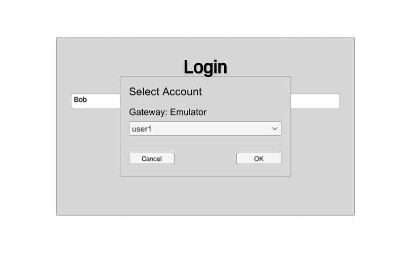

Followed shortly thereafter by the game screen;

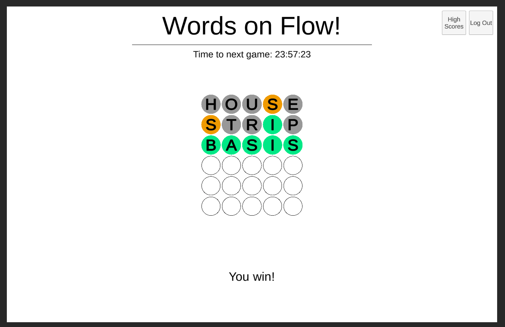

And the High Scores screen (if you click the button);

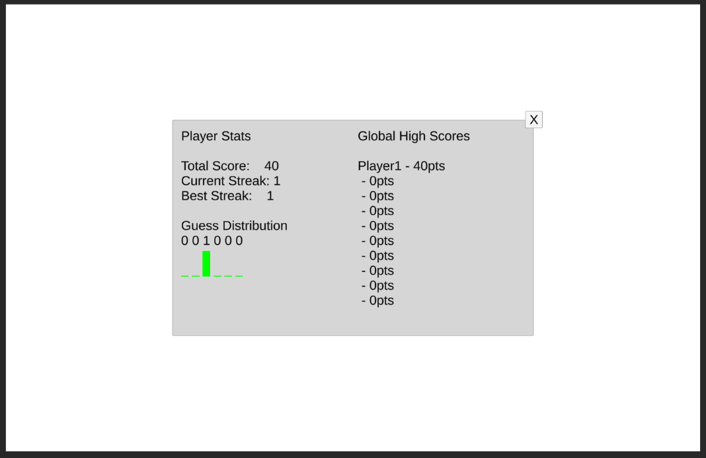

## Step 6 – Further Experimentation

For an extra challenge, try some of the following;

-   Add more accounts and play with some friends, hot seat style
-   Modify the game-contract.cdc to make a new game every 5 minutes instead of every 24 hours.
-   Try to remove and redeploy the contract  
    (hint: on testnet and mainnet, once removed, a contract’s name can never be used again on the same account)  
    (extra hint: delete-game-resources.cdc)
-   Poke about in the game contracts, scripts and transactions to see what they do!

If you ever get the emulator into a messy state, you can always hit the Clear Persistent Data button, which will wipe the emulator back to its blank state. This will of course lose all deployed contracts and high score and game history.

## Appendix – How to convert FlowWords to run on TestNet

To modify the tutorial project to run on TestNet, only minor modifications are required.

1. Change the network configuration to point to TestNet
2. Replace the DevWallet provider with a more secure solution. e.g. WalletConnect
3. Configure Account and update Text Replacements
4. Deploy the contract to TestNet

### Change the network configuration to TestNet

To change the network configuration, simply modify the start function as follows;

```cs
private void Start()
{
    if (Instance != this)
    {
        Destroy(this);
    }

    // Set up SDK to access TestNet
    FlowConfig flowConfig = new FlowConfig()
    {
        NetworkUrl = "https://rest-testnet.onflow.org/v1",  // testnet
        Protocol = FlowConfig.NetworkProtocol.HTTP
    };
    FlowSDK.Init(flowConfig);

    // Register DevWallet wallet provider with SDK
    FlowSDK.RegisterWalletProvider(new DevWalletProvider());
}
```

We have now replaced the emulator address with the address for the TestNet access point, and all subsequent transactions and scripts will be directed to TestNet.

### Replace DevWallet with WalletConnect

To now change the wallet provider, simply modify the start function as follows;

```cs
private void Start()
{
    if (Instance != this)
    {
        Destroy(this);
    }

    // Set up SDK to access TestNet
    FlowConfig flowConfig = new FlowConfig()
    {
        NetworkUrl = "https://rest-testnet.onflow.org/v1",  // testnet
        Protocol = FlowConfig.NetworkProtocol.HTTP
    };
    FlowSDK.Init(flowConfig);

    // Create WalletConnect wallet provider
    IWallet walletProvider = new WalletConnectProvider();
    walletProvider.Init(new WalletConnectConfig
    {
        ProjectId = "<YOUR PROJECT ID>", // insert Project ID from Wallet Connect dashboard
        ProjectDescription = "A simple word guessing game built on FLOW!",
        ProjectIconUrl = "https://walletconnect.com/meta/favicon.ico",
        ProjectName = "FlowWords",
        ProjectUrl = "https://dapperlabs.com"
    });

    // Register WalletConnect wallet provider with SDK
    FlowSDK.RegisterWalletProvider(walletProvider);
}
```

You will also need to add the following using declarations to the top of the file;

```cs
using DapperLabs.Flow.Sdk.WalletConnect;
using DapperLabs.Flow.Sdk.Crypto;
```

For this modification we have created a new WalletConnectProvider, and initialized it, and then registered our new WalletConnectProvider.

The only thing missing is a Project Id.\
Each WalletConnect application requires its own project id. You can get one by going to https://cloud.walletconnect.com and signing up for an account.\
You can then create a new project on the website, give it a name (we suggest FlowWords), and enter the project id provided into your code.

Finally, we need one more change to make sure our text replacement still functions correctly.

At the beginning of the OnAuthSuccess function, change the FLOW_ACCOUNT GatewayName from "Emulator" to "Flow Testnet".

```cs
// get FLOW account - we are only going to use this for text replacements
FLOW_ACCOUNT = new FlowControl.Account
{
    GatewayName = "Flow Testnet",
    AccountConfig = new Dictionary<string, string> { { "Address", FlowSDK.GetWalletProvider().GetAuthenticatedAccount().Address } }
};
```

### Configure Account and update Text Replacements

To deploy the contract to TestNet, the only current way to do so via the FlowSDK, is to use a TestNet account to which you know the private key.

First, in the Accounts tab of the Flow Control window, create a new account by clicking the plus '+' icon at the top of the window.\
Create the new account as follows, replacing the Address and Private Key with your own valid TestNet address / private key pair.

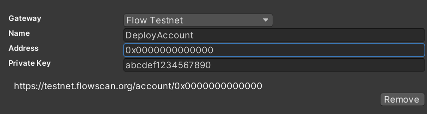

Switch to the Text Replacements tab of the Flow Control window now, and create a new text replacement definition as follows, replacing the given replacement text with the address to your TestNet account.

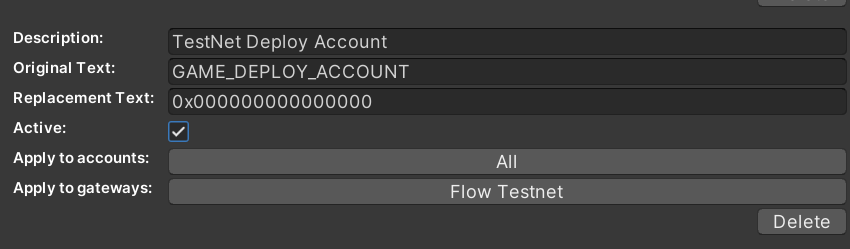

Now modify the existing CONTRACT_NAME text replacement, by changing the Apply to Gateways field from Emulator, to All. This will make sure this replacement also applies to TestNet transactions.

### Deploy the Contract to TestNet

Now that all of the configuration is done, you can deploy the contract.

On the Tools tab of the Flow Control window, set up the Manage Contracts section as follows;

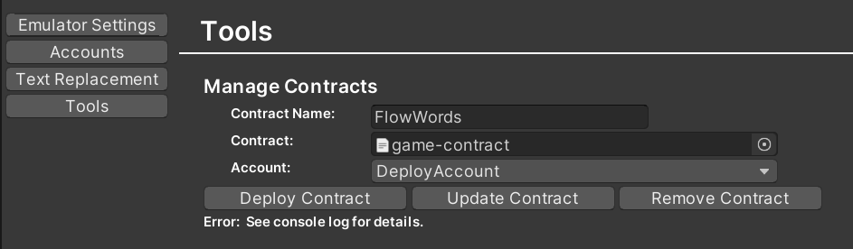

Where;
- Contract Name is the name of the contract on the blockchain. This should match the text replacement configured for CONTRACT_NAME
- Contract is the game-contract.cdc asset included with the project sample in the Assets\\Samples\\Flow SDK\\<version>\\Flow Words Tutorial Assets\\Resources directory.
- Account is the new Deploy Account that you created in the previous step.

Once you have the Manage Contracts section filled in as per the example, click Deploy Contract.

If all goes well, you will see the text 'Executing Transaction' appear below the Deploy Contract button, followed by a clickable link to the transaction result on flowscan.

Congratulations! You can now run FlowWords, and play the game with a WalletConnect compatible wallet!

> **NOTE:** TestNet requires that all contracts deployed to an account have a unique name, does not allow contract removal without authorisation, and only allows contract updates that do not break interfaces or data structures or introduce undefined data to existing resources.\
\
Due to these limitations, iterative development should always be done on Emulator before attempting to push anything to a live network.

